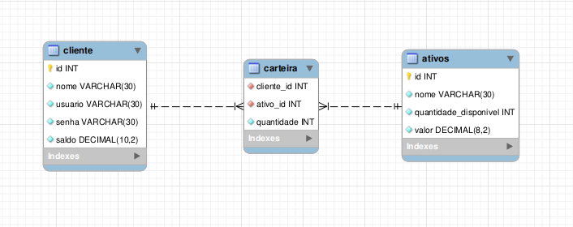

# Boas vindas ao repositório do desafio XP de Eduardo de Souza Rodrigues!

Aqui você vai encontrar as tecnologias utilizadas no desenvolvimento dessa aplicação, tomadas de decisões e instruções para compilar o projeto em questão.

# Técnologias utilizadas
   <div style="margin-top: 30px" style="display: inline_block">
     <h3>
      
      Javascript
     </h3>
   </div>     
  - A linguagem de programação mais utilizada no mercado.
  <div style="margin-top: 30px" style="display: inline_block">
     <h3>
      
      Node.js
     </h3>
   </div>     
  - Um motor em javascript para o back-end que possui ampla utilização.
  <h3>
      
      Linux
     </h3>
   </div>     
  - Um SO baseado no Unix, o que o torna junto ao Mac OS, os dois sistemas ideais para desenvolvimento.
  
  <h3>
       
      GIT
     </h3>
   </div>     
  - Um sistema de versionamento de código, essencial para qualquer desenvolvedor.
  
  <h3>
       
      GITHUB
     </h3>
   </div>     
  - A maior plataforma de hospedagem de código e versionamento.
  <h3>
      
      VS Code
     </h3>
   </div>     
  - Um editor de código-fonte de código aberto desenvolvido pela Microsoft.
   <h3>
     MySQL
     </h3>
   </div>     
  - Um dos maiores sistemas de gerenciamento de banco de dados.
  <h3>
      
      ClearDB
     </h3>
   </div>     
  - Utilizado na hospedagem do banco de dados em nuvem.
  
   <h3>
      
      Heroku
     </h3>
   </div>     
  - Utilizado para o deploy da aplicação.

# Banco de dados
O banco de dados modelado em mysql possui a seguinte estrutura:
<div> </div>
Dessa forma inclui mais alguns campos no banco, como o campo nome na tabela de ativos e clientes, de forma que o mesmo fique mais completo e faça mais sentido.

# Rodando o projeto localmente vs na nuvem

## Localmente

 1. Clone o repositório

  - `git clone git@github.com:DesouzaEdu/Desafio-XP.git`.
  - Entre na pasta do repositório que você acabou de clonar:
    - `cd Desafio-XP`

  2. Instale as dependências

  - `npm install`

  3. Inicialize o serviço mysql local
  
  - `sudo service mysql start`

  4. Rode o script de criação do banco que está no arquivo `dbInvest.sql`
  5. Coloque as suas variáveis de ambiente localizada no arquivo `.env`
  6. Pronto! Agora basta usar sua ferramenta cliente de API REST, como Insomnia ou Postman para consumir os endpoints.
## Na nuvem
Tanto o banco quanto a aplicação já estão na nuvem, então basta consumir o seguinte link na tua ferramente cliente de API REST: https://desafio-xp-edu.herokuapp.com/

Obs.: No caso da primeira requisição ela pode ser um pouco mais demorada que o costume.

## :warning: Endpoint Login
O endpoint `/login` deve ser o primeiro a ser rodado pois ele geram um token necessário para validações das outras requisições, isso deve ser feito devido a validação JWT.

# Endpoints
## POST `/login`
- O endpoint é acessível através do URL `/login`;
- O corpo da requisição deve seguir o formato abaixo:
  ```json
  {
    "usuario": "admin",
    "senha": "admin"
  }
  ```
### :warning: Ele te retornará um token, copie este token e crie um campo `authorization` nos headers das fututras requisições, onde este token deverá estar.

## POST `/investimentos/comprar`
- O endpoint é acessível através do URL `/investimentos/comprar`;
- O corpo da requisição deve seguir o formato abaixo:
  ```json
  {
    "codCliente": integer,
    "codAtivo": integer,
    "qtdeAtivo": integer
  }
  ```
  - `codCliente` é o id do cliente que efetuará a compra.
  - `codAtivo` é o id do ativo que será comprado.
  - `qtdeAtivo` é a quantidade que será comprada.
 - Aqui são validados as entradas quanto ao tipo e se o cliente/ativo em questão existem no banco, como é possível ver no script de criação do banco, ele possui por padrão 3 entradas tanto para cliente quanto para ativos.
 - Também há validações para ver se a quantidade desejada de compra existe no mercado e se o cliente possui saldo suficente para comprá-la.
 - Depois de efetuada a compra a carteira do cliente é atualizada com o novo ativo, bem como a quantidade do ativo no mercado e o saldo do cliente.

## POST `/investimentos/vender`
- O endpoint é acessível através do URL `/investimentos/vender`;
- O corpo da requisição deve seguir o formato abaixo:
  ```json
  {
    "codCliente": integer,
    "codAtivo": integer,
    "qtdeAtivo": integer
  }
  ```
  - `codCliente` é o id do cliente que efetuará a venda.
  - `codAtivo` é o id do ativo que será vendido.
  - `qtdeAtivo` é a quantidade que será vendida.
 - Aqui são validados as entradas quanto ao tipo e se o cliente/ativo em questão existem no banco, como é possível ver no script de criação do banco, ele possui por padrão 3 entradas tanto para cliente quanto para ativos.
 - Também há validações para ver se a quantidade a ser vendida é maior do que a disponível em carteira.
 - Depois de efetuada a venda a carteira do cliente é atualizada, bem como a quantidade do ativo no mercado e o saldo do cliente.

## GET `/ativos/cliente/:id`
- O endpoint é acessível através do URL `/ativos/cliente/:id`;
- E espera um retorno no seguinte formato:
  ```json
  {
    "codCliente": integer,
    "codAtivo": integer,
    "qtdeAtivo": integer,
    "valor": decimal
  },
  {
    "codCliente": integer,
    "codAtivo": integer,
    "qtdeAtivo": integer,
    "valor": decimal
  }
  ```
 - Este endpoint retorna todos os ativos que o cliente possui em carteira, dentro de um array.

## GET `/ativos/:id`
- O endpoint é acessível através do URL `/ativos/:id`;
- E espera um retorno no seguinte formato:
  ```json
  {
    "codAtivo": integer,
    "qtdeAtivo": integer,
    "valor": decimal
  }
  ```
 - Este endpoint retorna as informações do ativo segundo seu id.

## POST `/conta/deposito`
- O endpoint é acessível através do URL `/conta/deposito`;
- O corpo da requisição deve seguir o formato abaixo:
  ```json
  {
    "codCliente": integer,
    "valor": decimal
  }
  ```
   - `codCliente` é o id do cliente que fará o deposito.
   - `valor` é o valor do deposito.
 - Aqui são validados as entradas quanto ao tipo e se o cliente em questão existe no banco, como é possível ver no script de criação do banco, ele possui por padrão 3 entradas para cliente.
 - Também há validações para ver se o valor é negativo ou menor que 0.

## POST `/conta/saque`
- O endpoint é acessível através do URL `/conta/saque`;
- O corpo da requisição deve seguir o formato abaixo:
  ```json
  {
    "codCliente": integer,
    "valor": decimal
  }
  ```
   - `codCliente` é o id do cliente que fará o saque.
   - `valor` é o valor do saque.
 - Aqui são validados as entradas quanto ao tipo e se o cliente em questão existe no banco, como é possível ver no script de criação do banco, ele possui por padrão 3 entradas para cliente.
 - Também há validações para ver se o valor é negativo ou menor que 0 e se o valor a ser sacado está disponível em conta.

## GET `/conta/:id`
- O endpoint é acessível através do URL `/conta/:id`;
- E espera um retorno no seguinte formato:
  ```json
  {
    "codCliente": integer,
    "saldo": decimal
  }
  ```
 - Este endpoint retorna as informações do conta do cliente segundo seu id.
